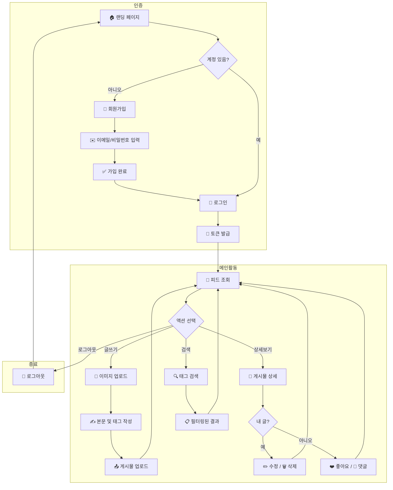
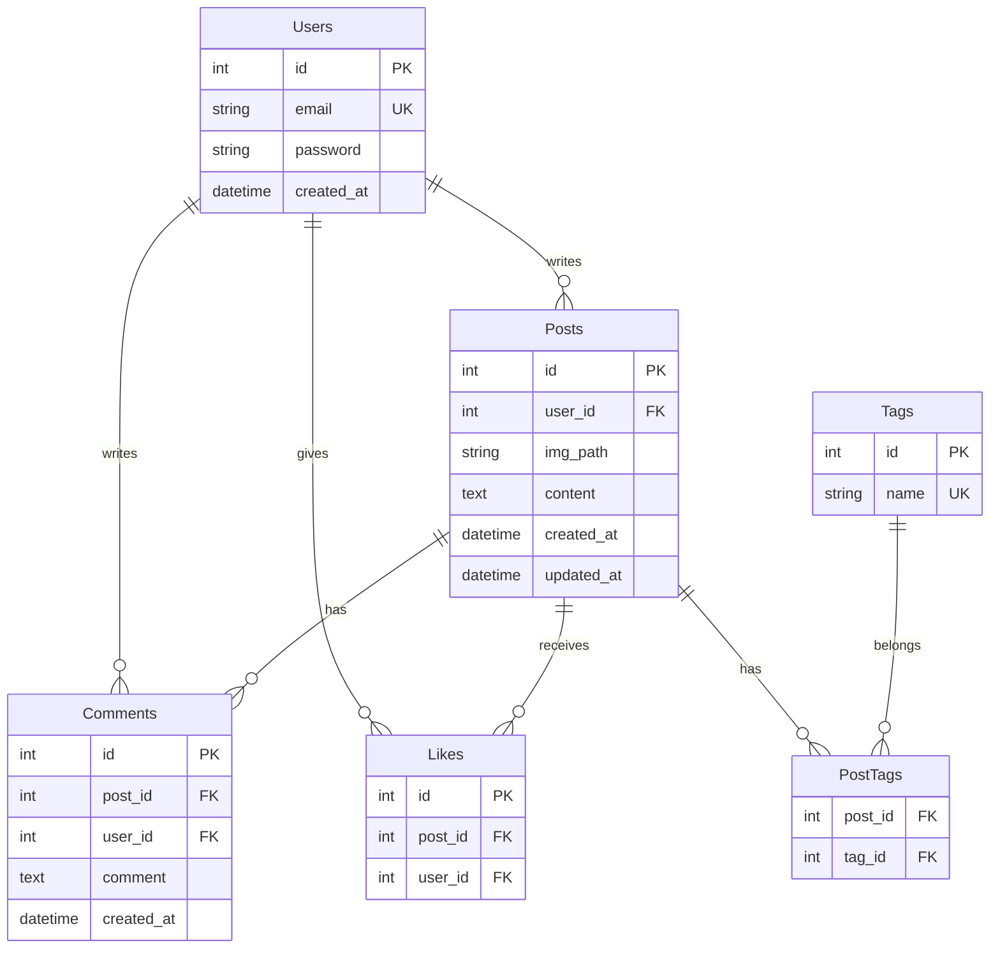

# [PRD] 경량 인스타그램 (Instagram Lite for Workshop)

이 문서는 웹 서비스의 기본 구조인 **CRUD, 사용자 인증, 데이터베이스 관계**를 학습하기 위한 가이드라인입니다.

## 1. 문서 개요

* **프로젝트명**: 워크숍용 인스타 라이트 (Insta-Lite)
* **목표**: 3시간 내에 웹 서비스의 핵심 로직(회원가입, 게시글 작성, DB 저장)을 구현하고 배포함.
* **기술 스택**:
  * **Frontend**: HTML/CSS, Vanilla JS
  * **Backend**: Python 3.12 + FastAPI (타입 힌트, 자동 API 문서 생성으로 입문자 친화적)
  * **Database**: SQLite (파일 기반의 가벼운 DB로, 입문자가 관리하기 가장 쉬움)
  * **Storage**: 로컬 서버 디렉토리 (이미지 저장용)
  * **Password Hashing**: bcrypt (비밀번호 암호화)
  * **Package Manager**: uv (빠르고 간편한 Python 패키지 관리)

### 개발 환경 설정

프로젝트 루트에 `.venv` 가상환경이 이미 설정되어 있습니다. 아래 명령어로 활성화하세요.

```bash
# 가상환경이 없는 경우 생성
if [ ! -d ".venv" ]; then
  uv init --python 3.12 && uv sync
fi

# 가상환경 활성화
source .venv/bin/activate

# 필요한 패키지 설치 (pyproject.toml에 정의된 의존성)
uv sync
```

---

## 2. 사용자 스토리 (User Story)

입문자의 눈높이에서 사용자가 앱에서 경험할 시나리오입니다.

1. **가입**: "나는 소모임 활동을 위해 내 이메일로 계정을 만들고 싶어."
2. **게시**: "나는 내 일상을 담은 사진과 글을 올리고, 친구들이 검색하기 쉽게 `#태그`를 달고 싶어."
3. **교류**: "나는 친구의 글에 '좋아요'를 눌러 공감을 표시하고 싶어."
4. **관리**: "내가 올린 글에 오타가 있다면 수정하거나 삭제하고 싶어."

### 사용자 여정 (User Journey)



---

## 3. 기능 명세 (Feature Specifications)

### P0 (필수 기능: 이것이 없으면 서비스가 작동하지 않음)

* **F1. 이메일 기반 인증**:
  * **설명**: 사용자의 신원을 확인하는 과정입니다. DB에 `Users` 테이블을 만들고 이메일과 `bcrypt`로 암호화된 비밀번호를 저장합니다.
  * **학습 포인트**: 세션(Session) 혹은 JWT 토큰을 통해 '로그인한 상태'를 유지하는 법을 배웁니다.

* **F2. 이미지 및 게시글 업로드**:
  * **설명**: 사진 파일을 서버로 보내고, 서버는 이를 특정 폴더에 저장한 뒤 그 **'파일 경로'**를 DB에 기록합니다.
  * **학습 포인트**: 클라이언트(브라우저)에서 서버로 파일을 전송하는 `Multipart/form-data` 개념을 이해합니다.

* **F3. 피드 조회 (Read)**:
  * **설명**: DB에 저장된 모든 게시물을 최신순으로 가져와 화면에 뿌려줍니다.

* **F4. 수정/삭제 권한 체크**:
  * **설명**: 수정/삭제 요청이 들어왔을 때 `현재 로그인한 유저 ID == 게시글 작성자 ID`인지 확인합니다.
  * **학습 포인트**: CRUD의 Update/Delete 완성 및 권한(Authorization) 개념 이해.

### P1 (보조 핵심 기능: 서비스의 재미를 더함)

* **F5. 좋아요 및 댓글**:
  * **설명**: 특정 게시물 ID와 사용자 ID를 연결하여 '좋아요' 테이블에 기록합니다.
  * **학습 포인트**: 데이터 간의 **1:N(게시글:댓글)** 또는 **N:M(사용자:좋아요)** 관계를 학습합니다.

### P2 (디테일 기능: 시간 여유 시 구현)

* **F6. 태그 검색**:
  * **설명**: 글 내용 중 `#` 뒤에 오는 단어를 추출해 `Tags` 테이블에 저장하고, 검색 시 해당 태그가 연결된 게시물만 필터링합니다.
  * **학습 포인트**: N:M 관계(게시글:태그) 및 중간 테이블(`PostTags`) 개념 이해.

---

## 4. 인터페이스 요구사항 (UI/UX)

입문자용이므로 디자인보다는 **구조**에 집중합니다.

| 페이지 | 구성 요소 |
|--------|-----------|
| **회원가입 페이지** | 이메일, 비밀번호, 비밀번호 확인 입력란, 가입 버튼, 로그인 페이지 링크 |
| **로그인 페이지** | 이메일, 비밀번호 입력란, 로그인 버튼, 회원가입 페이지 링크 |
| **메인 피드 페이지** | 상단: 로고(홈 링크) + 로그아웃 버튼<br>글쓰기 버튼 (모달 혹은 별도 페이지)<br>카드 형태의 게시물 목록 (이미지 - 본문 - 태그 - 좋아요 버튼 - 댓글 리스트) |
| **게시글 상세 페이지** | 게시물 전체 내용, 댓글 작성 폼, 댓글 목록, 수정/삭제 버튼(작성자만 표시) |

---

## 5. API 엔드포인트 (RESTful)

| Method | Endpoint | 설명 | 인증 |
|--------|----------|------|------|
| POST | `/api/auth/register` | 회원가입 | ❌ |
| POST | `/api/auth/login` | 로그인 (토큰 발급) | ❌ |
| GET | `/api/posts` | 전체 게시물 조회 | ❌ |
| POST | `/api/posts` | 게시물 작성 | ✅ |
| GET | `/api/posts/{id}` | 게시물 상세 조회 | ❌ |
| PUT | `/api/posts/{id}` | 게시물 수정 | ✅ (작성자만) |
| DELETE | `/api/posts/{id}` | 게시물 삭제 | ✅ (작성자만) |
| POST | `/api/posts/{id}/like` | 좋아요 토글 | ✅ |
| POST | `/api/posts/{id}/comments` | 댓글 작성 | ✅ |
| GET | `/api/tags/{tag_name}` | 태그별 게시물 검색 | ❌ |

---

## 6. 데이터베이스 설계 (ERD)

SQLite에서 생성할 핵심 테이블 구조입니다.



### 테이블 요약

| 테이블 | 주요 필드 | 설명 |
|--------|-----------|------|
| **Users** | id, email, password, created_at | 사용자 정보 |
| **Posts** | id, user_id, img_path, content, created_at, updated_at | 게시글 및 이미지 경로 |
| **Comments** | id, post_id, user_id, comment, created_at | 댓글 정보 |
| **Likes** | id, post_id, user_id | 좋아요 (중복 방지: post_id + user_id 유니크) |
| **Tags** | id, name | 태그 목록 |
| **PostTags** | post_id, tag_id | 게시글-태그 N:M 관계 |

---

## 7. 에러 처리 범위

워크숍 범위상 **최소한의 에러 핸들링**만 구현합니다.

| 상황 | 처리 방식 |
|------|-----------|
| 중복 이메일 가입 시도 | 400 Bad Request + "이미 존재하는 이메일입니다" |
| 잘못된 로그인 정보 | 401 Unauthorized + "이메일 또는 비밀번호가 틀립니다" |
| 권한 없는 수정/삭제 | 403 Forbidden + "권한이 없습니다" |
| 존재하지 않는 리소스 | 404 Not Found |
| 서버 내부 오류 | 500 Internal Server Error (상세 로그는 서버에만 기록) |

---

## 8. 인수 조건 (Definition of Done)

워크숍 종료 시 아래 항목이 통과되어야 성공입니다.

1. 새로운 이메일로 회원가입 후 로그인이 정상적으로 되는가?
2. 사진을 업로드했을 때, 서버 폴더에 파일이 생성되고 화면에 출력되는가?
3. 내가 작성한 글만 '수정/삭제' 버튼이 활성화(혹은 작동)되는가?
4. 좋아요 버튼을 누르면 즉시 반영되고, 다시 누르면 취소되는가?
5. 댓글을 작성하면 해당 게시물에 표시되는가?
6. (P2) 특정 태그를 검색했을 때 관련 게시물만 필터링되는가?
7. **가장 중요**: 로컬에서 만든 앱이 SaaS(예: Render)를 통해 외부 링크로 접속 가능한가?

---

## 9. 워크숍 진행 전략

> **Boilerplate 제공 방식 권장**
>
> 3시간 워크숍이라면 코드를 처음부터 짜기보다, 아래 부분은 **미리 뼈대 코드**를 제공하고 핵심 로직을 직접 채워보게 하는 방식이 학습 효과가 가장 좋습니다.
>
> * 이미지 업로드 로직 (Multipart 처리)
> * DB 연동 및 세션/토큰 설정
> * 기본 HTML/CSS 템플릿
>
> 참가자가 직접 구현할 부분:
> * IF문을 활용한 권한 체크 로직
> * CRUD API 핸들러 작성
> * 좋아요/댓글 기능 연결